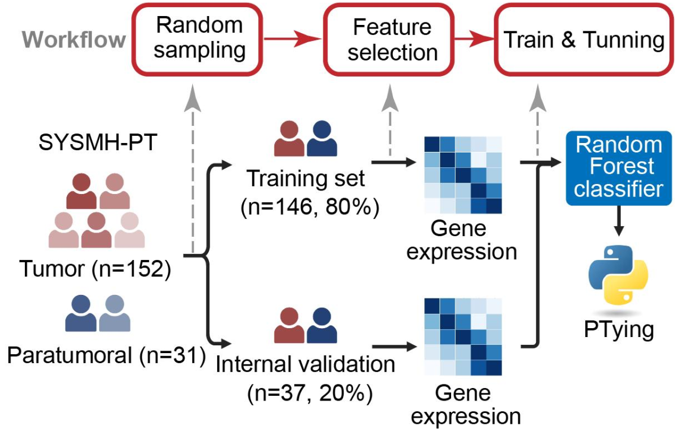

# PTMolecularClassification
Molecular Classification for Phyllode Tumors

This project aims to enhance the understanding and management of phyllodes tumors, aggressive fibroepithelial breast neoplasms with high recurrence. Currently, surgery is the primary treatment due to the lack of effective medical therapies, and histopathological diagnosis cannot reliably predict tumor behavior or outcomes. By establishing a large cohort and leveraging multi-omics data, we seek to identify molecular subtypes to improve prognosis prediction and guide targeted treatments. We also developed a gene signature classifier and IHC-based markers to define subtypes and predict clinical outcomes. This research aims to advance precision medicine for phyllodes tumors, enabling personalized therapeutic strategies for better patient care.

[Figures](https://github.com/BioinfoCenterSYSMH/PTMolecularClassification/tree/main)

[PTGraphSubtyping](https://github.com/BioinfoCenterSYSMH/PTMolecularClassification/tree/PTGraphSubtyping)

[PTyping](https://github.com/BioinfoCenterSYSMH/PTMolecularClassification/tree/PTyping)
